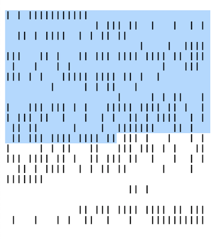

# baseIO
## display base16 encoded data as binary

A specialized font family to display hex values as binary values.

There are currently two weights: **Normal** and **Bold**
The fonts are in .ttf, .woff and .svg format.

## Usage

- Add `font.css` and `fonts` folder to your project.
- Add `<link rel="stylesheet" href="font.css">` to the head of your html-page
- Add rule `font-family: "baseIO-Normal";` or `font-family: "baseIO-Bold";` where needed

Look in the index.html for a complete example.

## Character Mapping

| hex | bin
| --- | ---
| 0   | `    ` 
| 1   | `   |` 
| 2   | `  | ` 
| 3   | `  ||` 
| 4   | ` |  ` 
| 5   | ` | |` 
| 6   | ` || ` 
| 7   | ` |||` 
| 8   | `|   ` 
| 9   | `|  |`
| a   | `| | ` 
| b   | `| ||` 
| c   | `||  ` 
| d   | `|| |` 
| e   | `||| ` 
| f   | `||||` 

## Future

- More weights might be added **Light**, **Medium**, **Heavy**
- representation of base64 encoded values as binary could make sense 
- embed font as base64 encoded url
